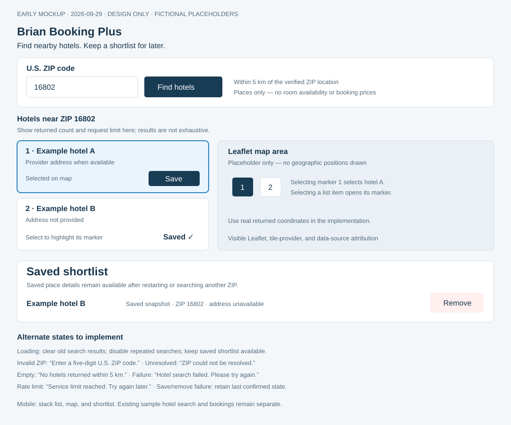

# Assignment 2 — research and early design

Prepared September 29, 2026, before implementing Geoapify hotel retrieval, the map, or the persistent shortlist. The ZIP lookup already exists. This is a proposed design, not a record of completed functionality or student approval.

## Early mockup

The illustration uses explicitly fictional example hotels. Numbered controls in the map placeholder explain selection correspondence; they are not geographic positions or provider results. The placeholder is not a working map. No key, price, availability, or booking claim appears.

## Research consulted

These are agent-reviewed documentation sources, not evidence of a student personally testing another application.

| Source | Useful observation | Limitation or mismatch for this assignment | Proposed decision |
| --- | --- | --- | --- |
| [Airbnb search filters](https://www.airbnb.com/help/article/479) | Destination and filters help narrow accommodation searches; the page also directs users to maps and descriptions. | Date, price, and booking filters require information our location provider does not establish. This page is help documentation, not a hands-on UI test. | Start with one ZIP control; pair the result list with a map; omit invented prices, ratings, and availability. |
| [Geoapify Places API](https://apidocs.geoapify.com/docs/places/) | A categories-based place search supplies external location data. | Coverage and fields vary; returned places are not proof of available rooms. | Backend hotel search around the verified ZIP point with a 5 km radius; validate coordinates and document the chosen result cap. |
| [Leaflet reference](https://leafletjs.com/reference.html) | Maps support markers, popups, events, keyboard navigation, and attribution controls. | Leaflet supplies map interaction, not hotel data or room inventory; imagery still needs a tile provider. | Share a selected provider place ID between list and map, keep attribution visible, and make actions keyboard accessible. |
| [Geoapify pricing](https://www.geoapify.com/pricing/) | Free tier currently lists 3,000 credits/day and up to 5 requests/second; attribution is required. | Credits and request limits constrain repeated live testing. Actual credit cost depends on the request. | Submit-driven searches, no automatic provider calls on map movement, mocked failure/rate-limit tests, and a small number of live demonstrations. |

## Proposed interaction

1. Enter a five-digit ZIP string, preserving leading zeros, then select Find hotels.
2. Clear stale search results, show loading, and block duplicate searches. Keep saved items independent of this state.
3. Backend verifies the requested U.S. ZIP before searching hotels within 5 km of that returned point.
4. Show real returned name/address fields and honest missing-field labels. Use the same selection identifier in the list and map. Do not imply an exhaustive inventory.
5. Save creates a shortlist entry only after server confirmation. An already-saved provider place ID shows Saved and cannot create another entry; enforce uniqueness in SQLite as well.
6. Shortlist displays saved snapshots, not a dependency on the current live response. Remove deletes only the selected saved entry after successful backend confirmation; failures retain the last confirmed UI state.

Default layout: ZIP search above adjacent list and map; shortlist below. On narrow screens, stack list, map, then shortlist. Alternative for review: place shortlist beside results on large screens, trading map width for more immediate saved-item visibility.

## State checklist

Design includes loading, invalid input, unresolved ZIP, successful results, no nearby hotels, provider failure, quota/rate-limit response, no saved hotels, already saved, save pending/failure, and remove pending/failure. Empty shortlist copy: “No saved hotels yet. Save a place from your results.” Errors must never be represented as a successful empty search.

## Implementation plan after design review

- View: Vue owns controls, presentation, loading/error states, and shared list/map selection.
- Controllers: backend handles postcode verification, Places requests, validation, and shortlist operations; routes stay thin.
- External-place model: provider plus provider_place_id, available name/address, latitude, longitude, originating search ZIP, and saved timestamp. Store a recognizable snapshot without requiring a sample-hotel nightly rate. Enforce unique provider/place ID.
- SQLite: additive migration preserving existing sample tables and booking data. Verify persistence using temporary databases and clearly labeled disposable records.
- Choose a tile provider and verify its usage/attribution requirements before implementation. Never reuse the private backend key as a frontend tile credential.
- Inspect dependencies and propose exact required installs for approval before any package change.

## Planned evidence, not yet completed

Use a labeled fixed JSON fixture and repeat instructions for duplicates, removal, restart persistence, malformed/missing fields, empty results, and simulated errors/rate limits. Capture SQLite before/after evidence and one live recorded demonstration with tested ZIP/date. Verify keyboard controls and existing hotel search. Record expected versus observed results and remaining limitations.

## Review and revision record

- Initial draft: September 29, 2026. Created by the coding agent from the assignment and sources above.
- Student authorized implementation in the conversation and explicitly approved Leaflet 1.9.4. Personal source exploration and final review are not claimed.
- Implementation revision: use a scrollable list alongside the map after observing 20 live results; label the shortlist as shared locally across demo travelers. Keep saved snapshots independent of live results.
- Tile decision: standard OpenStreetMap raster tiles, with visible attribution and browser caching, following the [tile usage policy](https://operations.osmfoundation.org/policies/tiles/). No prefetch, bulk download, or backend key in tile URLs.
- Existing report.md describes earlier sample-booking work; this design document does not replace the new assignment report.
